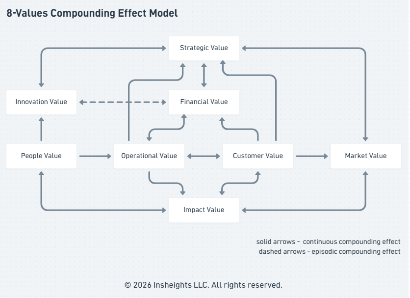

# Insheights 8 Values Model

**Customer Value | Financial Value | People Value | Operational Value | Market Value | Strategic Value | Innovation Value | Impact Value**

The organizational value measurement model of the Insheights Integrated Value Creation System, developed by Insheights LLC.

The Insheights 8 Values Model defines how the Insheights Integrated Value Creation System generates Organization Value — translating the outcomes of strategy, transformation, and delivery into eight dimensions of value that compound over time into sustained organizational impact. Each Value is operationally grounded in the IIVCS, behaviorally measured through AER, and delivery-measured through 3E.

- **Operational** — each Value is generated through OSM, PTS, and CVDM, not observed from outside
- **Behavioral** — AER operates across two parallel tracks: Customer AER measuring how customers respond to value delivery, and Organizational AER measuring how the delivering organization responds to its own operating model
- **Compounding** — Values do not operate independently; they reinforce and amplify each other over time

The 8 Values bridge directly to the International Integrated Reporting Council (IIRC) 6 Capitals framework — translating IIVCS operational value generation into the stock of capitals reported to investors and stakeholders.



---

## The Measurement Architecture

The 8 Values sit within a connected measurement architecture. 3E measures how value is delivered. AER measures behavioral response to that delivery — across two parallel tracks. The 8 Values measure what the organization generates as a result — across every dimension of organizational life.

```
3E              Efficiency → Experience → Effectiveness
                       ↓
Customer AER    Adoption → Engagement → Retention
Org AER         Adoption → Engagement → Retention
                       ↓
8 Values    →   Organization Value → Impact
```

3E drives both AER tracks — Efficiency enables Adoption, Experience deepens Engagement, Effectiveness earns Retention — across customer and organizational dimensions.

**Customer AER** measures how customers respond to value delivery:
- **Adoption** — customers take up the value offered, entering the value stream
- **Engagement** — customers actively use the value, returning signal through the journey
- **Retention** — customers persist, choosing this value stream over time

**Organizational AER** measures how the delivering organization responds to its own operating model:
- **Adoption** — teams adopt the operating model, practices, and ways of working
- **Engagement** — teams engage with purpose, culture, and the work — active participation, not compliance
- **Retention** — talent, institutional knowledge, and organizational stability are sustained

Customer AER drives Customer and Financial Value directly. Organizational AER drives People Value directly. Both compound across the remaining Values over time.

---

## The Eight Values

---

### 1. Customer Value

**Behavioral Response | Perception | Satisfaction**

The complete measure of value realized by customers — combining behavioral response through Adoption, Engagement, and Retention with customer perception, satisfaction, and trust. Customer Value is the most direct expression of whether the IIVCS is delivering on its promise.

Customer Value has two connected layers:

- **Behavioral** — what customers do: whether they adopt the value offered, engage actively with it, and return over time. Measured through AER — Adoption, Engagement, and Retention — which translates directly to Growth and Revenue
- **Perception** — what customers feel: their satisfaction, confidence, and trust in the value delivered. Measured through experience feedback, satisfaction signals, and Net Promoter indicators

Neither layer is sufficient alone. Behavioral adoption without positive perception is fragile — customers who use but do not trust are at risk. Positive perception without behavioral engagement is hollow — customers who feel good but do not act generate no value.

Customer Value is primarily generated through CVDM — where every journey step is designed to trigger the right value stage, delivering the value proposition as a realized customer outcome.

| IIVCS Connection | How Customer Value Is Generated |
|---|---|
| **OSM** | Stakeholder and customer expectations shape strategic value priorities — Customer Value starts at strategy |
| **PTS** | Teams organized around customer-facing value streams build the capabilities that serve customer needs |
| **CVDM** | Every journey step triggers the right value stage — delivering outcomes customers adopt, engage with, and return to |
| **3E** | Efficiency enables Adoption; Experience drives Engagement; Effectiveness earns Retention |

---

### 2. Financial Value

**Current Performance | Forward-Looking Potential**

The measure of current and forward-looking financial performance — encompassing revenue, profitability, margin, unit economics, pipeline, customer lifetime value, and revenue potential. Financial Value is the most visible expression of Organization Value to investors and stakeholders, but it is a lagging outcome of the other seven Values working together.

Financial Value has two connected layers:

- **Current** — revenue, profitability, gross and net margin, unit economics per customer and per value stream. What the organization is generating now
- **Forward** — pipeline strength, customer lifetime value, revenue potential from existing and new value streams. What the organization is positioned to generate

Financial Value is directly driven by Customer Value — AER translating to Growth and Revenue — and amplified by Operational, Strategic, and Innovation Value over time.

| IIVCS Connection | How Financial Value Is Generated |
|---|---|
| **OSM** | Strategic value priorities determine where financial investment generates the greatest return |
| **PTS** | Efficiency as a table stake — transformation that is not cost-effective destroys Financial Value before it begins |
| **CVDM** | Delivery learning and performance optimization continuously improve the unit economics of value delivery |
| **3E → AER** | Adoption drives revenue growth; Retention drives revenue sustainability; Engagement drives revenue depth |

---

### 3. People Value

**Employees | Partners | Contractors | Ecosystem**

The measure of human capability and engagement across the full workforce — employees, leaders, partners, contractors, and ecosystem participants — including culture, growth, and organizational depth. People Value recognizes that value is generated by people, and that the capability and engagement of the full human network determines what the organization can achieve.

People Value has two connected layers:

- **Internal** — employee capability, engagement, culture strength, leadership depth, and organizational learning. The people inside the organization who execute strategy, build product, and deliver value
- **Extended** — partner capability, contractor quality, ecosystem participant engagement. The people outside the organization who extend its reach and amplify its capacity

People Value is most directly shaped by PTS — where POM Enablers (Leadership, Practices & Behaviors, Organizational Architecture, Culture & Relationships) determine whether the human system is empowered to deliver.

| IIVCS Connection | How People Value Is Generated |
|---|---|
| **OSM** | Strategy that is understood and believed in by people drives engagement and ownership |
| **PTS** | POM Enablers — Leadership, Culture & Relationships, Organizational Architecture — directly build People Value |
| **CVDM** | Cross-functional ownership of the full value delivery chain builds capability depth and engagement |
| **3E** | Experience dimension captures whether people feel the culture, growth, and confidence that define People Value |

---

### 4. Operational Value

**Capability Stock | Execution Quality | Value Stream Performance**

The measure of organizational capability stock, execution quality, and value stream performance — the accumulated processes, systems, and institutional knowledge that enable the organization to consistently and efficiently create and deliver value. Operational Value is the internal engine of the organization — what it has built, how well it runs, and how consistently it delivers.

Operational Value has three connected layers:

- **Stock** — the accumulated capability: processes, systems, tools, institutional knowledge, and technical assets the organization has built over time
- **Execution** — how efficiently and effectively the organization runs: process maturity, system reliability, capability activation quality, and delivery consistency
- **Output** — value stream performance: how consistently and efficiently value streams activate the right capabilities and processes at each journey step

Operational Value is the foundation that all other Values depend on. Without it, Customer Value cannot be delivered consistently, Financial Value cannot compound, and Strategic Value cannot be executed.

| IIVCS Connection | How Operational Value Is Generated |
|---|---|
| **OSM** | Execution & Deployment organized by value stream builds operational capability as a strategic asset |
| **PTS** | The product operating model — capabilities, processes, and team structures — is the primary generator of Operational Value |
| **CVDM** | Delivery learning and performance optimization continuously improve value stream execution quality |
| **3E** | Efficiency is the primary 3E dimension for Operational Value — friction-free execution is both its measure and its output |

---

### 5. Market Value

**Brand | Reputation | Position | Differentiation | Ecosystem**

The externally perceived value of the organization — brand strength, reputation, market position, competitive differentiation, and ecosystem relationships as seen by the market. Market Value is what the market believes the organization is worth and capable of — independent of what it currently delivers. It is earned through consistent delivery of the other Values and lost through inconsistency, failure, or misalignment.

Market Value has two connected layers:

- **Brand and reputation** — the perception of the organization's identity, trustworthiness, and quality in the minds of customers, partners, and the market
- **Position and ecosystem** — the organization's standing relative to competitors, its differentiation, and the strength of its partner and ecosystem relationships

Market Value amplifies all other Values — strong market position makes Customer Value easier to earn, Financial Value easier to sustain, and Strategic Value easier to execute. It is both an outcome of the other Values and an input to them.

| IIVCS Connection | How Market Value Is Generated |
|---|---|
| **OSM** | Vision and mission, consistently executed, build the brand narrative that generates Market Value |
| **PTS** | Consistent delivery of quality through the product operating model builds reputational credibility |
| **CVDM** | Customer experience and satisfaction signals aggregate into brand perception and market reputation |
| **3E → AER** | Retention and advocacy from satisfied customers is the most powerful generator of Market Value |

---

### 6. Strategic Value

**Formulation Quality | Execution Effectiveness | Agility | Risk**

The measure of strategy formulation quality and execution effectiveness — how clearly direction is set, how well strategy translates to outcomes, and how effectively the organization manages agility and risk. Strategic Value recognizes that strategy is both an asset — when it is clear, well-formed, and believed in — and a liability when it is unclear, static, or disconnected from execution reality.

Strategic Value has two connected layers:

- **Formulation** — the quality of strategic direction: clarity of vision and mission, relevance of value priorities, strength of strategic hypotheses, and quality of stakeholder alignment
- **Execution** — how well strategy translates to outcomes: execution quality, portfolio performance, organizational agility in responding to change, and risk management effectiveness

Strategic Value is most directly generated by OSM — where strategic intent is formed, tested, and continuously refined through a feedback loop between governance and execution.

| IIVCS Connection | How Strategic Value Is Generated |
|---|---|
| **OSM** | Strategic Value Creation — informed by internal/external context, stakeholder expectations, and enterprise risk — is the primary generator of Strategic Value |
| **PTS** | Strategy becomes executable through the product operating model — PTS tests whether strategic intent can be operationalized |
| **CVDM** | Strategic evolution feedback loop returns delivery outcomes upstream — customer reality continuously refines strategic direction |
| **3E** | Effectiveness is the primary 3E dimension for Strategic Value — outcomes achieved validate strategic hypotheses |

---

### 7. Innovation Value

**Current IP | R&D Effectiveness | Capability Expansion | Future Value Streams**

The measure of current and forward-looking value creation — existing intellectual property, R&D effectiveness, capability expansion, and the new value streams and products being built for the future. Innovation Value is the organization's capacity to create value it does not yet deliver — the pipeline of future Organization Value being built today.

Innovation Value has two connected layers:

- **Current** — existing IP, R&D in progress, capability expansion underway, and innovations being brought to market now
- **Forward** — new value streams being designed, future products and services in discovery, and the organizational capacity to continue creating new value

Innovation Value is most directly generated by PTS — where the Discover phase continuously explores new value opportunities, and the full product lifecycle from Discover through Support creates the conditions for innovation to compound.

| IIVCS Connection | How Innovation Value Is Generated |
|---|---|
| **OSM** | Strategic value priorities determine where innovation investment is directed — Innovation Value starts with strategic intent |
| **PTS** | Continuous discovery, hypothesis-driven thinking, and the full product lifecycle from Discover through Support generate Innovation Value |
| **CVDM** | Journey insights and delivery learning surface unmet customer needs — the raw material of Innovation Value |
| **3E** | Effectiveness measures whether innovation is generating real outcomes — not just activity |

---

### 8. Impact Value

**Mission | ESG | Society | Environment | Community**

The measure of value generated beyond commercial interest — mission advancement, ESG performance, and contribution to society, community, and the environment. Impact Value recognizes that organizations exist within and affect a broader system, and that the value they generate — or destroy — beyond their commercial boundaries is a genuine dimension of Organization Value.

Impact Value has two connected layers:

- **Internal** — mission advancement and ESG performance: how well the organization lives its stated purpose, manages its environmental footprint, and governs itself with integrity
- **External** — societal, environmental, and community contribution: the value generated for people and systems beyond the organization's direct commercial interest

Impact Value is not separate from the other Values — it is amplified by them and amplifies them in return. Organizations with strong Impact Value attract better people (People Value), stronger market position (Market Value), and greater stakeholder trust (Customer and Financial Value).

| IIVCS Connection | How Impact Value Is Generated |
|---|---|
| **OSM** | Values, Mission, and Vision — the foundation of OSM — set the direction for Impact Value at the strategic level |
| **PTS** | Culture & Relationships as a POM Enabler shapes whether teams operate with the integrity and purpose that generates Impact Value |
| **CVDM** | The experience customers, partners, and communities have with the organization's delivery defines its societal reputation |
| **3E** | Experience and Effectiveness together measure whether the organization's impact is felt and realized — not just intended |

---

## 8 Values and IR 6 Capitals — The Bridge

The Insheights 8 Values model is the operational measurement layer of the IIVCS — measuring how value is generated through strategy, transformation, and delivery. It bridges directly to the International Integrated Reporting Council (IIRC) 6 Capitals framework, translating operational value generation into the stock of capitals reported to investors and stakeholders.

The bridge is directional — 8 Values measure the flow of value generation; IR 6 Capitals measure the resulting stock of value held.

| Insheights 8 Values | IR 6 Capitals | Translation |
|---|---|---|
| **Customer Value** | Social & Relationship Capital | Customer behavioral response and perception builds the relationship capital stock |
| **Financial Value** | Financial Capital | Current and forward-looking financial performance is the financial capital stock |
| **People Value** | Human Capital | Workforce capability and engagement across employees, partners, and ecosystem is the human capital stock |
| **Operational Value** | Manufactured + Intellectual Capital | Capability stock, systems, and institutional knowledge maps to both manufactured and intellectual capital |
| **Market Value** | Social & Relationship Capital | Brand, reputation, and ecosystem relationships are the externally perceived relationship capital stock |
| **Strategic Value** | Intellectual Capital | Strategy formulation quality and execution effectiveness builds intellectual and organizational capital |
| **Innovation Value** | Intellectual Capital | IP, R&D, and future value streams are the intellectual capital pipeline |
| **Impact Value** | Natural + Social Capital | Mission, ESG, and societal contribution maps to natural and social capital |

The bridge enables organizations using the IIVCS to report operational value generation in IR-compatible terms — connecting delivery metrics to board and investor-level reporting without requiring separate measurement systems.

---

## 8 Values and the IIVCS Frameworks

Each IIVCS framework generates value across multiple dimensions simultaneously. The 8 Values make that generation visible and measurable.

| Value | OSM | PTS | CVDM |
|---|---|---|---|
| **Customer Value** | Sets customer-facing priorities | Builds customer-serving capabilities | Delivers customer outcomes |
| **Financial Value** | Directs investment to highest return | Manages transformation cost efficiency | Optimizes delivery unit economics |
| **People Value** | Aligns people to strategic direction | Empowers cross-functional teams | Builds delivery capability depth |
| **Operational Value** | Organizes execution by value stream | Builds the product operating model | Measures value stream performance |
| **Market Value** | Shapes brand through vision and mission | Builds reputational credibility through delivery | Generates advocacy through customer experience |
| **Strategic Value** | Primary generator — strategy formation and testing | Tests whether strategy is executable | Returns customer reality to strategic reassessment |
| **Innovation Value** | Directs innovation investment | Primary generator — continuous discovery and delivery | Surfaces unmet needs as innovation inputs |
| **Impact Value** | Sets mission and purpose | Builds culture of integrity and purpose | Delivers impact through customer and community experience |

---

## Feedback

The 8 Values metrics surface organizational outcomes back to OSM's Governance & Measurement and PTS's operating model — forming the organizational feedback layer of the IIVCS. See [IIVCS Feedback System](feedback.md).

---

## Summary

Organization Value is not a single metric — it is the sum of eight interconnected dimensions generated through every act of strategy, transformation, and delivery across the IIVCS.

Customer Value and Financial Value are the most visible — behavioral and financial proof that the system is working. People Value and Operational Value are the engine — the human and capability foundation that makes sustained delivery possible. Market Value and Strategic Value are the multipliers — amplifying what is built and directing where it goes next. Innovation Value and Impact Value are the future — ensuring the organization continues to create value beyond what it delivers today.

The feedback runs in all directions. Customer Value signals inform Strategic Value reassessment. Operational Value gaps surface as Innovation Value opportunities. People Value strength amplifies Market Value. Impact Value commitment deepens Customer and People Value. No dimension stands alone — each generates and is generated by the others.

Measured through 3E, expressed behaviorally through AER, and bridged to IR 6 Capitals for external reporting, the Insheights 8 Values model is how the IIVCS makes Organization Value visible, measurable, and continuously improvable.

---

© 2026 Insheights LLC. All rights reserved.
