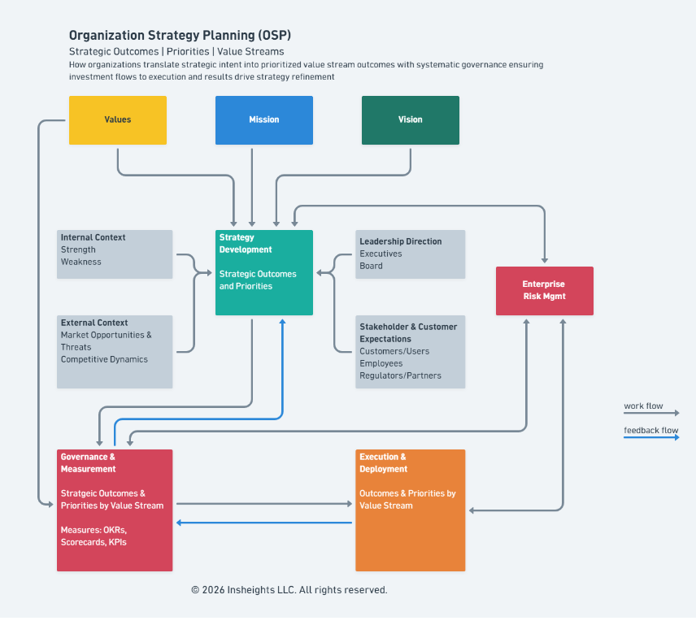
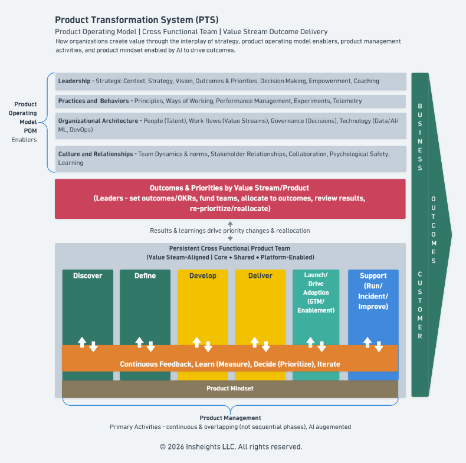

# Insheights Frameworks

A collection of organizational and product frameworks developed by Insheights LLC.

---

## OSP — Organization Strategy Planning

**Strategic Outcomes | Priorities | Value Streams**

How organizations translate strategic intent into prioritized value stream outcomes. OSP connects Values, Mission, and Vision through a Strategy Development process informed by internal/external context, leadership direction, stakeholder expectations, and enterprise risk — then drives execution through a continuous feedback loop between Governance & Measurement and Execution & Deployment.

---

## PTS — Product Transformation System

**Product Operating Model | Cross Functional Team | Value Stream Outcome Delivery**

How organizations create value through the interplay of strategy, product operating model enablers, product management activities, and product mindset — enabled by AI to drive outcomes. PTS defines four POM Enablers (Leadership, Practices & Behaviors, Organizational Architecture, Culture & Relationships) that empower persistent cross-functional product teams to work through continuous, overlapping phases: Discover, Define, Develop, Deliver, Launch, and Support — underpinned by a continuous feedback and learning loop.

---

## CVDM — Customer Value Delivery Model

**Customer Journey | Value Stream | Value Delivery**

How organizations map customer journeys to value streams, ensuring customer needs trigger appropriate capabilities and processes that deliver value. CVDM connects Customer/User journeys to Value Propositions, Products/Services, Value Streams, Capabilities, and Processes — with five continuous feedback loops covering experience feedback, journey insights, delivery learning, strategic evolution, and performance optimization.

---

© 2026 Insheights LLC. All rights reserved.
