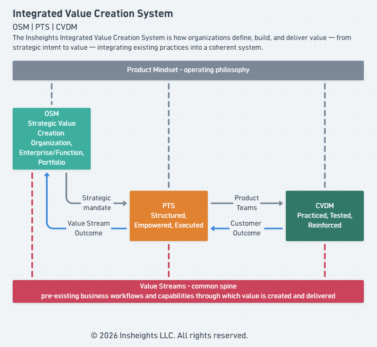

# Insheights Integrated Value Creation System 

**Organization Strategy Model (OSM) | Product Transformation System (PTS) | Customer Value Delivery Model (CVDM)**

An integrated system of organizational and product frameworks developed by Insheights LLC.

The Insheights Integrated Value Creation System (IIVCS) is how organizations define, build, and deliver value — from strategic intent to realized customer outcome — by integrating existing practices into a coherent system rather than replacing them.

- **Integrated** — purposefully unified across strategy, operating model, and value delivery
- **Value Creation** — the single purpose the whole system serves
- **System** — interdependent parts that work as one

**Product Mindset** is the operating philosophy of the system — shaping how strategy is formed, how teams are built, and how value is delivered.

| Product Mindset Principle | Description |
|---|---|
| Customer obsession | Every decision starts with the customer — their journey, needs, and experience take priority over internal preferences or assumptions |
| Outcome over output | Success is measured by value delivered to the customer, not by features shipped or tasks completed |
| Continuous discovery | Teams stay in constant contact with reality — learning from customers, data, and feedback rather than building on assumptions |
| Hypothesis-driven thinking | Every initiative is treated as a testable assumption — teams define what they expect, deliver, and learn from the result |
| Cross-functional ownership | Teams own the full value delivery chain end-to-end — not individual functions or hand-offs |

---

## OSM — Organization Strategy Model

**Strategic Value Creation | Value Priorities | Value Streams**

How organizations translate strategic intent into prioritized value creation outcomes. OSM connects Values, Mission, and Vision through a Strategic Value Creation process informed by internal/external context, leadership direction, stakeholder/customer expectations, and enterprise risk — then drives execution through a continuous feedback loop between Governance & Measurement and Execution & Deployment by Value Stream.

The organization approaches Strategic Value Creation with a Product Mindset — strategies are living hypotheses, continuously tested and refined as execution generates signal. Strategy inputs are never static: market shifts, stakeholder expectations, and delivery outcomes continuously feed back into strategic reassessment. Product Mindset maturity — the organization's readiness to operate this way — is an internal context factor that shapes which strategies are realistic and executable.

Value Streams — the pre-existing business workflows and capabilities through which value is created and delivered — are the organizing unit of execution across OSM, PTS, and CVDM. 

OSM scales vertically across the organization (Organization > Enterprise/Functions > Portfolio)

| Level | Scope | Primary Users |
|---|---|---|
| **Organization** | Organization-wide strategic intent and value priorities | CEO, Board, Executive Team |
| **Enterprise / Function** | Enterprise/Function alignment to organization strategic intent | Enterprise/Functional Leaders, Business Units |
| **Portfolio** | Portfolio alignment to Enterprise/Function intent and value stream allocation | Portfolio Managers, Product Leaders |

Each Product Mindset principle has a direct role in OSM:

| Product Mindset Principle | How It Shows Up in OSM |
|---|---|
| Customer obsession | Stakeholder & Customer Expectations is a direct input to Strategic Value Creation — customer needs shape where value priorities are set |
| Outcome over output | Strategic Objectives are defined as Outcomes and Value Priorities, not activities or deliverables |
| Continuous discovery | Strategy inputs are never static — market shifts, stakeholder expectations, and delivery outcomes continuously feed back into strategic reassessment |
| Hypothesis-driven thinking | Strategies are living hypotheses — Governance & Measurement tests whether strategic bets are generating expected outcomes |
| Cross-functional ownership | Execution & Deployment is organized by Value Stream, not by department or function — ownership cuts across organizational boundaries |

---

## PTS — Product Transformation System

**Product Operating Model (POM) | Cross Functional Team | Value Stream Outcome Delivery**

How organizations create value through the interplay of strategy, product operating model enablers, product management activities, and product mindset — enabled by AI to drive outcomes. PTS defines four POM Enablers (Leadership, Practices & Behaviors, Organizational Architecture, Culture & Relationships) that empower persistent cross-functional product teams to work through continuous, overlapping phases: Discover, Define, Develop, Deliver, Launch, and Support — underpinned by a continuous feedback and learning loop.

PTS is where OSM's strategic intent, value priorities, and value streams are:

- **Structured** — into a product operating model organized around value streams
- **Empowered** — through persistent cross-functional teams built to own and deliver those value priorities
- **Executed** — through the Customer Value Delivery Model

Product Mindset is the foundation empowered teams carry into every phase.

Each Product Mindset principle has a direct role in PTS:

| Product Mindset Principle | How It Shows Up in PTS |
|---|---|
| Customer obsession | Teams are organized around value streams that serve customer needs — POM Enablers orient the operating model toward customer outcomes, not deliverables |
| Outcome over output | Leadership sets Outcomes/OKRs, not feature lists — teams are measured on value delivered, not tasks completed |
| Continuous discovery | Discover is continuous and overlapping — teams never stop learning from customers, data, and market signals across all phases |
| Hypothesis-driven thinking | Each phase from Discover through Support is a testable assumption — the feedback and learning loop validates or corrects direction |
| Cross-functional ownership | Persistent cross-functional teams own the full value delivery chain end-to-end — from Discover through Support — without hand-offs |

---

## CVDM — Customer Value Delivery Model

**Customer Journey | Value Stream | Value Delivery**

CVDM ensures every Customer/User journey step triggers the right Value Stream stage — defining the Products/Services, Capabilities, Processes, and Information flows required to deliver the Value Proposition as a realized customer outcome — with five continuous feedback loops covering experience feedback, journey insights, delivery learning, strategic evolution, and performance optimization.

Product Mindset, carried into CVDM by empowered teams from PTS, is where it moves from philosophy to practice.

CVDM is the model where the Product Mindset is:

- **Practiced** — customer journey as the daily anchor, not features or tasks
- **Tested** — each value stage challenges whether the team is truly delivering customer value or just executing activity
- **Reinforced** — feedback loops return real signal that either validates or corrects the team's assumptions

Each Product Mindset principle has a direct home in CVDM:

| Product Mindset Principle | How It Shows Up in CVDM |
|---|---|
| Customer obsession | Anchors every decision to the Customer Journey — not the product, not the feature |
| Outcome over output | Maps to the Value Proposition and feedback loops — CVDM measures value received, not features shipped |
| Continuous discovery | Powers the feedback loop from Customer Experience back to Journey Insights |
| Hypothesis-driven thinking | Each Value Stage in CVDM is a testable assumption about how value is delivered |
| Cross-functional ownership | CVDM's Capability and Process require teams to own end-to-end delivery, not hand-offs |

---

## Comparison with Established Frameworks

The IIVCS is distinct from established Enterprise Architecture, product, and value delivery frameworks in its simultaneous coverage of customer journey, value stream delivery, outcome measurement, and upstream feedback. Standalone comparisons cover each layer:

- [IIVCS Comparison with Established Frameworks](iivcs-comparison.md) — TOGAF, BIZBOK, ArchiMate, SAFe, Service Blueprint, Value Stream Mapping, Jobs To Be Done
- [3E Comparison with Industry Standards](3e-comparison.md) — ISO 9241-11, Balanced Scorecard, Google HEART, NPS/CSAT/CES, AARRR
- [AER Comparison with Industry Standards](aer-comparison.md) — ADKAR, Kotter 8-Step, McKinsey 7-S, Employee Engagement Surveys, NPS
- [8 Values Comparison with Industry Standards](8-values-comparison.md) — Balanced Scorecard, IIRC 6 Capitals, EFQM, ESG/GRI, OKRs

---

## Summary

Value Streams — the pre-existing business workflows and capabilities 
through which value is created and delivered — are the common spine 
of the Insheights Integrated Value Creation System.

OSM **governs** the value streams, PTS **operationalizes** them, and CVDM **realizes** value through them. What each framework owns, how they align up and down the system, and where behavioral signal is measured are set out in [Framework Positioning](positioning.md) — the canonical reference for how the three relate.

The feedback runs upstream — CVDM to PTS to OSM — customer signals becoming delivery learning, delivery learning becoming strategic evolution, continuously refining where the organization creates value. See [Feedback](feedback.md).

3E — Efficiency, Experience, Effectiveness — is the measurement language of the IIVCS, sequenced as Use → Feel → Achieve, providing consistent measurement across every architecture element. AER — Adoption, Engagement, Retention — is the behavioral signal layer, measuring how customers respond to value delivery and how organizational teams respond to the operating model, across two parallel tracks. The 8 Values define what the organization generates through value creation — across Customer, Financial, People, Operational, Market, Strategic, Innovation, and Impact dimensions. See [Insheights 3E Operational Values Measurement Model](3e.md), [Insheights AER Behavioral Measurement Model](aer.md), and [Insheights 8 Organizational Values Measurement Model](8-values.md).

---

## Documents in This System

**Frameworks**
- This document — OSM (Organization Strategy Model), PTS (Product Transformation System), CVDM (Customer Value Delivery Model)
- [Framework Positioning](positioning.md) — how OSM, PTS, and CVDM relate within the system

**Measurement models**
- [Insheights 3E Operational Values Measurement Model](3e.md) — Efficiency, Experience, Effectiveness
- [Insheights AER Behavioral Measurement Model](aer.md) — Adoption, Engagement, Retention
- [Insheights 8 Organizational Values Measurement Model](8-values.md) — the eight value dimensions
- [IIVCS Feedback System](feedback.md) — operational and organizational feedback paths

**Comparisons with established frameworks**
- [IIVCS](iivcs-comparison.md) · [3E](3e-comparison.md) · [AER](aer-comparison.md) · [8 Values](8-values-comparison.md)

**Integration**
- [Integration with Existing Practices](integration.md) — SAFe, Scrum, OKRs, ITIL, ERM, Design Thinking, VSM, JTBD

**Practitioner guides** ([guides/](guides/))
- [3E Practitioners Guide](guides/3e-practitioners-guide.md)
- [8 Values Practitioners Guide](guides/8-values-practitioners-guide.md)

**Reference**
- [Glossary](glossary.md) — terms, acronyms, and external frameworks

**Planning**
- [Roadmap](ROADMAP.md)

---

© 2026 Insheights LLC. All rights reserved.
