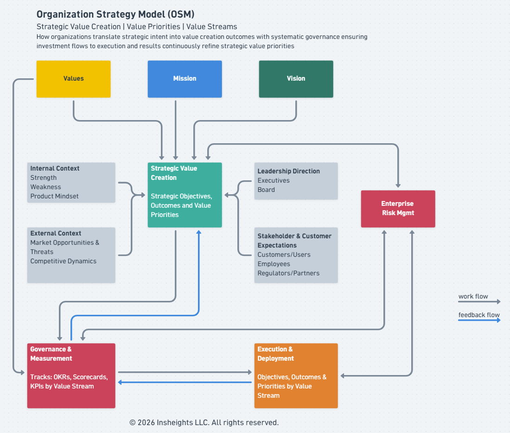
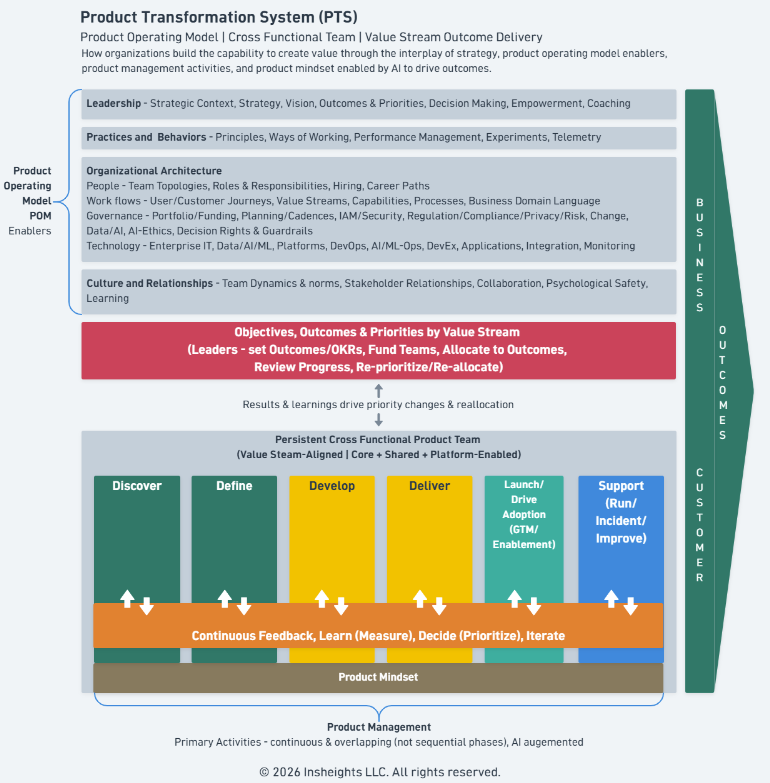
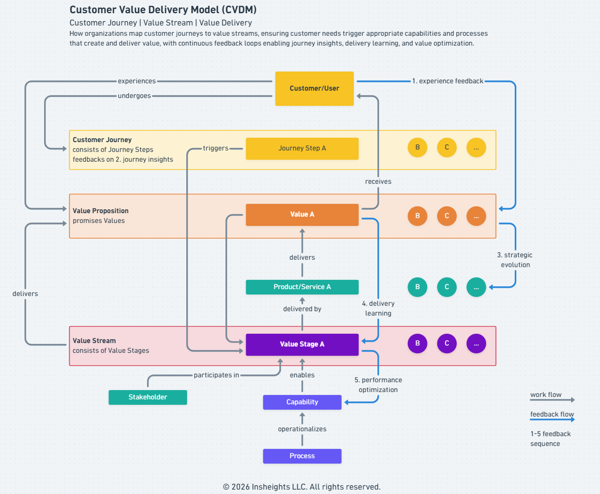

# Insheights Integrated Value Creation System 

An integrated system of organizational and product frameworks developed by Insheights LLC.

The Insheights Integrated Value Creation System is how organizations define, build, and deliver value — from strategic intent to value.

- **Integrated** — purposefully unified across strategy, operating model, and value delivery
- **Value Creation** — the single purpose the whole system serves
- **System** — interdependent parts that work as one

---

## OSM — Organization Strategy Model

**Strategic Value Creation | Value Priorities | Value Streams**

How organizations translate strategic intent into prioritized value creation outcomes. OSM connects Values, Mission, and Vision through a Strategic Value Creation process informed by internal/external context, leadership direction, stakeholder/customer expectations, and enterprise risk — then drives execution through a continuous feedback loop between Governance & Measurement and Execution & Deployment by Value Stream.

---

## PTS — Product Transformation System

**Product Operating Model | Cross Functional Team | Value Stream Outcome Delivery**

How organizations create value through the interplay of strategy, product operating model enablers, product management activities, and product mindset — enabled by AI to drive outcomes. PTS defines four POM Enablers (Leadership, Practices & Behaviors, Organizational Architecture, Culture & Relationships) that empower persistent cross-functional product teams to work through continuous, overlapping phases: Discover, Define, Develop, Deliver, Launch, and Support — underpinned by a continuous feedback and learning loop.

PTS is where OSM's strategic intent, value priorities, and value streams are:

- **Structured** — into a product operating model organized around value streams
- **Empowered** — through persistent cross-functional teams built to own and deliver those value priorities
- **Executed** — through the Customer Value Delivery Model

Product Mindset is the foundation empowered teams carry into every phase. 

| Product Mindset Principle | Description |
|---|---|
| Customer obsession | Every decision starts with the customer — their journey, needs, and experience take priority over internal preferences or assumptions |
| Outcome over output | Success is measured by value delivered to the customer, not by features shipped or tasks completed |
| Continuous discovery | Teams stay in constant contact with reality — learning from customers, data, and feedback rather than building on assumptions |
| Hypothesis-driven thinking | Every initiative is treated as a testable assumption — teams define what they expect, deliver, and learn from the result |
| Cross-functional ownership | Teams own the full value delivery chain end-to-end — not individual functions or hand-offs |

---

## CVDM — Customer Value Delivery Model

**Customer Journey | Value Stream | Value Delivery**

How organizations map customer journeys to value streams, ensuring customer needs trigger appropriate capabilities and processes that deliver value. CVDM connects Customer/User journeys to Value Propositions, Products/Services, Value Streams, Capabilities, and Processes — with five continuous feedback loops covering experience feedback, journey insights, delivery learning, strategic evolution, and performance optimization.

CVDM is the model where the Product Mindset is:

- **Practiced** — customer journey as the daily anchor, not features or tasks
- **Tested** — each value stage challenges whether the team is truly delivering customer value or just executing activity
- **Reinforced** — feedback loops return real signal that either validates or corrects the team's assumptions

Each Product Mindset principle has a direct home in CVDM:

| Product Mindset Principle | How It Shows Up in CVDM |
|---|---|
| Customer obsession | Drives the Customer Journey — the journey is the anchor, not the product |
| Outcome over output | Maps to the Value Proposition and feedback loops — CVDM measures value received, not features shipped |
| Continuous discovery | Powers the feedback loop from Customer Experience back to Journey Insights |
| Hypothesis-driven thinking | Each Value Stage in CVDM is a testable assumption about how value is delivered |
| Cross-functional ownership | CVDM's Capability and Process require teams to own end-to-end delivery, not hand-offs |

## Summary

OSM defines where value must be created. PTS structures, empowers, and executes around that intent. CVDM is the model where empowered teams practice, test, and reinforce their product mindset — delivering value to the customer continuously.

---

© 2026 Insheights LLC. All rights reserved.
